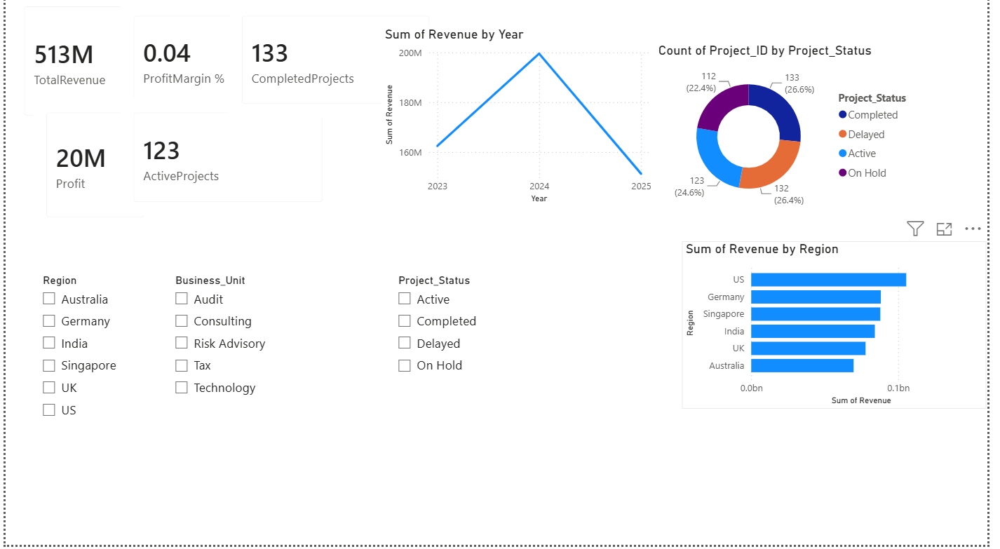
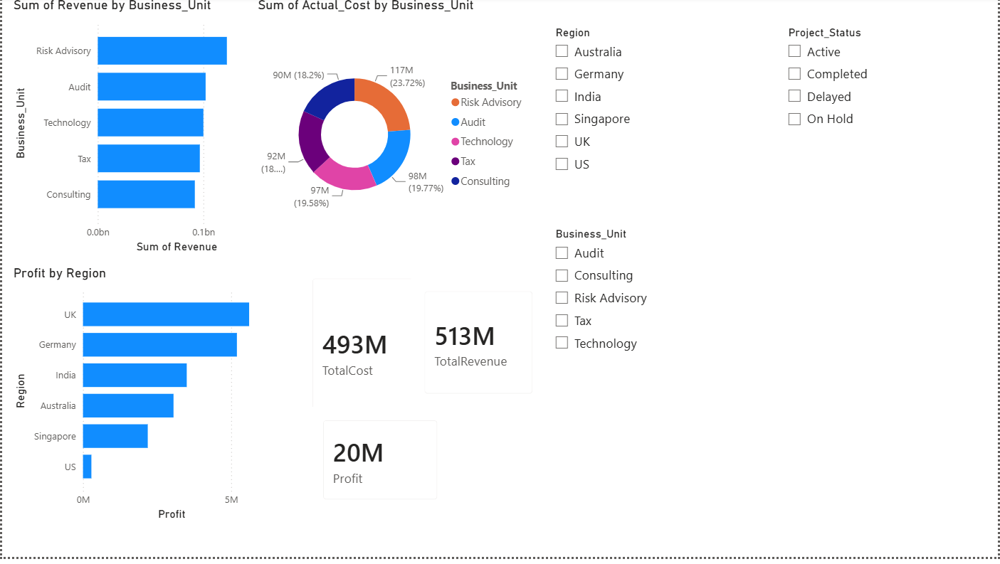
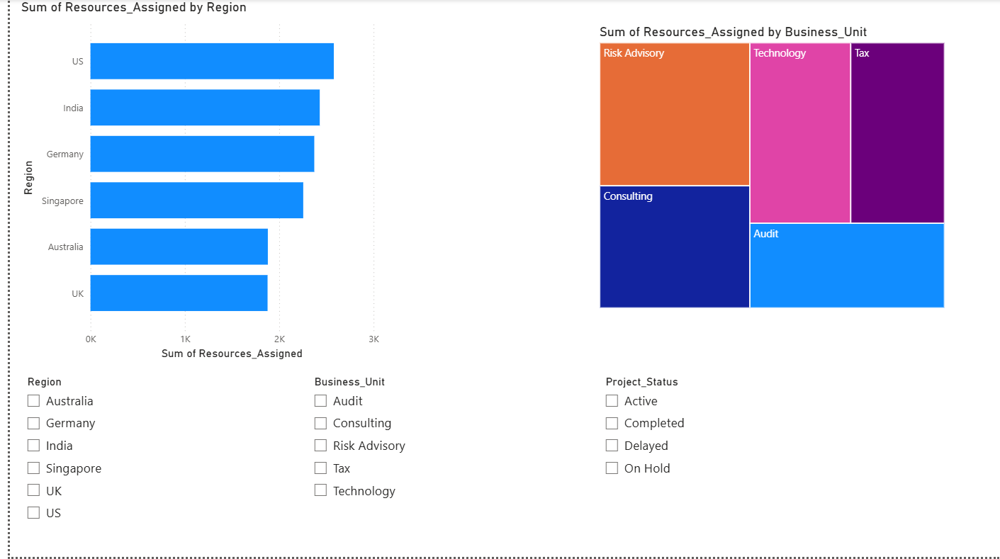
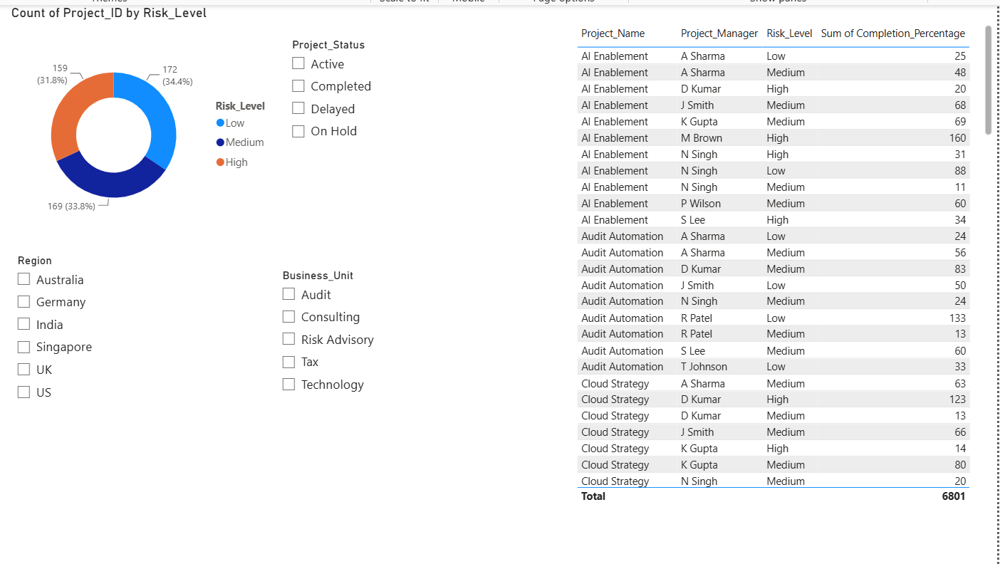

# Consulting Project Portfolio & Executive Performance Dashboard

## Overview

This project is an executive-level business intelligence dashboard developed using Power BI and Excel.

The dashboard provides insights into:

- Project Portfolio Performance
- Financial Performance
- Resource Utilization
- Risk & Governance
- KPI Monitoring

## Tools Used

- Power BI Desktop
- Microsoft Excel
- DAX
- Data Visualization

## Dashboard Pages

### Executive Overview
Tracks key business KPIs including revenue, profit, active projects, and completed projects.

### Project Portfolio
Analyzes budget vs actual costs and project completion rates.

### Financial Performance
Monitors revenue, costs, and profitability across business units and regions.

### Resource Utilization
Tracks resource allocation and workforce distribution.

### Risk & Governance
Identifies delayed and high-risk projects.

## Dataset

The dataset contains 500 simulated consulting projects across multiple regions and business units.

## Screenshots

(Add screenshots here)

## Skills Demonstrated

- Power BI
- Excel
- DAX
- Business Intelligence
- Data Visualization
- KPI Reporting
- Project Portfolio Analysis
- Financial Analysis
- Resource Management

  ## Dashboard Screenshots

